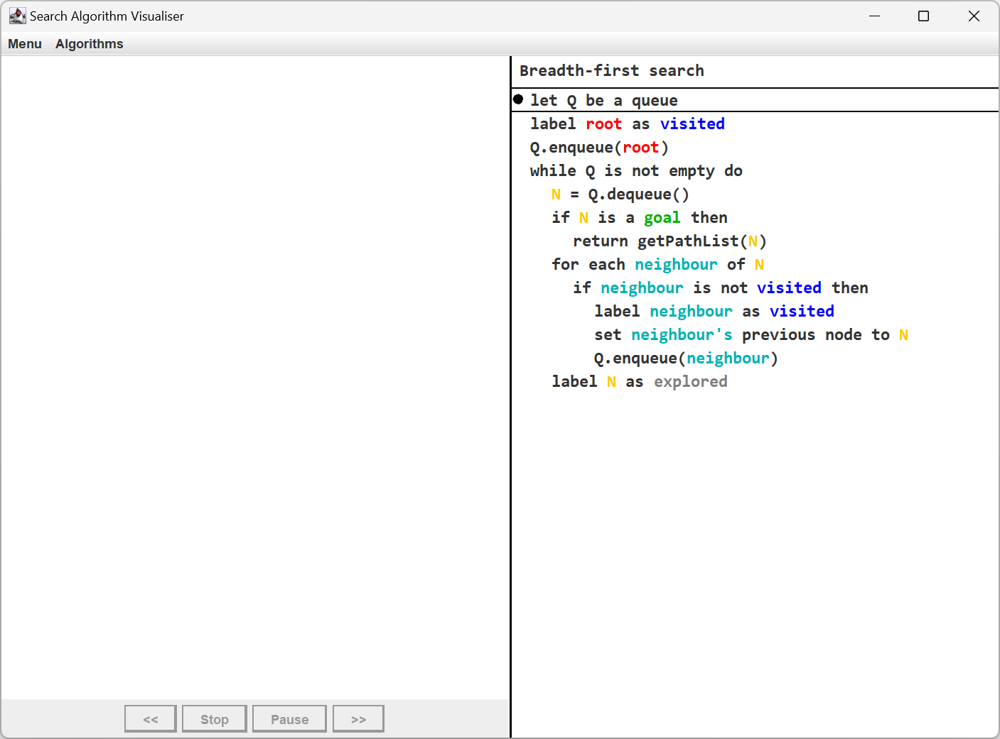
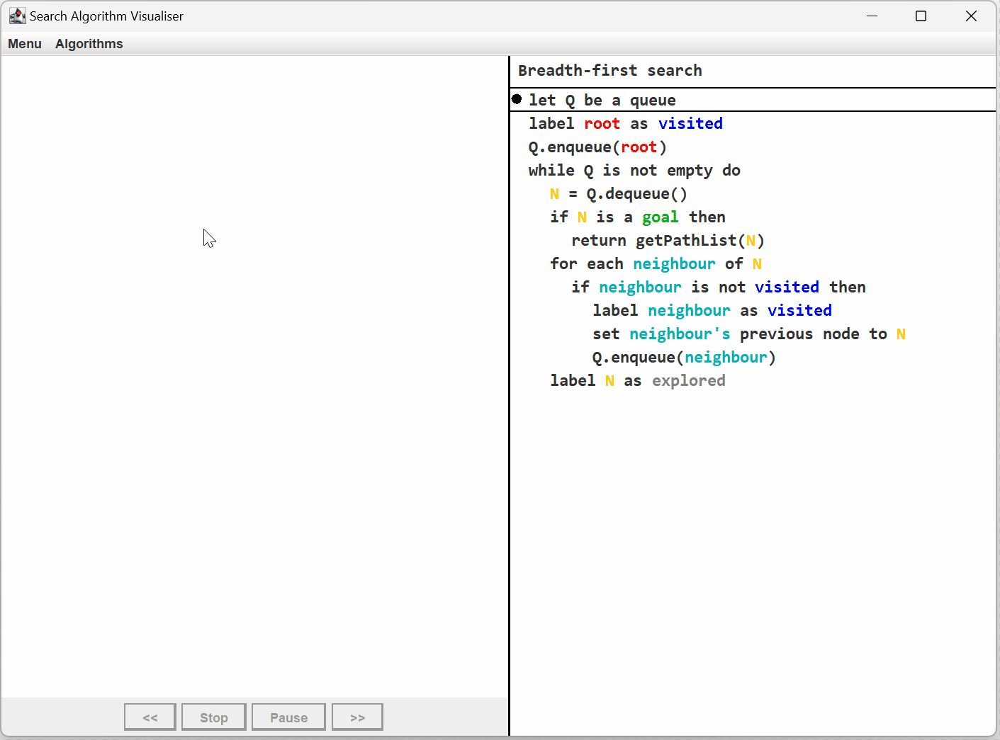

# Search Algorithm Visualisation Tool
This is a tool to aid with learning how search algorithms work by visualising an algorithm step by step.

# Dependencies
This tool requires Java to be installed.

If Java runtime is installed you can just run the .jar file. If not, use "java -jar SearchAlgorithmVisualiser.jar".

# Getting started
Once opened you should see a window like the below.

The left window (the main window) contains the graph and the right window contains the pseudocode

# Usage
## Main window
- Left click to create a _node_.
- Left click and drag on an existing _node_ to move the _node_.
- Right click on a _node_ or _edge_ to remove it.
- Right click and drag to draw _edges_ between _nodes_, letting go of right click when hovering over another _node_.
- Double left click on a _node_ to set the _node_ as a root/goal or unset the _node_ type.

## Pseudocode window
The pseudocode window is not interactive as is just there to provide help for learning a search algorithm.

## Toolbar
### Menu
The menu dropdown contains the following options:
- Run Algorithm – Run the current search algorithm on the current graph and start the visualisation.
- Clear Nodes – Remove all of the nodes in the graph.
- Reset Nodes – Reset the states of all the nodes in the graph, for example, if the nodes are labelled as visited or explored.
- Hide Pseudocode – Show or hide the pseudocode window.
- Node Label Type – Change the labelling of the nodes to be either Numeric or Alphabetic.
- Generate Random Graph - Generate a random graph with the entered number of _nodes_.

### Algorithms
The algorithms dropdown contains the following options:
- Breadth-First Search - Changes the current algorithm to BFS.
- Dept-First Search - Changes the current algorithm to DFS.
- Dijkstra's Algorithm - Changes the current algorithm to Dijkstra.
- A* - Changes the current algorithm to A*.

## Visualisation buttons
The buttons at the bottom of the main window are for when the search algorithm is being visualised, the _Pause/Resume_ button will either pause or resume the visualisation, the _<<_ or _>>_ buttons will step forwards or backwards through the states by 1 state (only when paused), and the _Stop_ button will stop visualisation entirely, allowing graph edits to take place.

## Demonstration of useage

